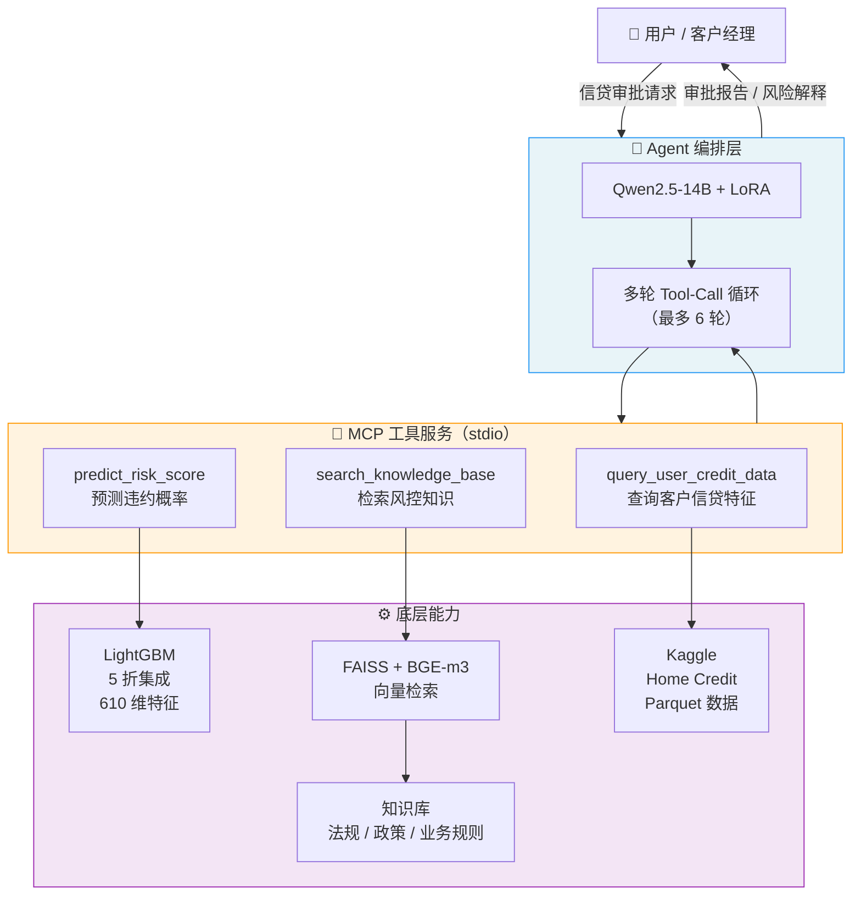
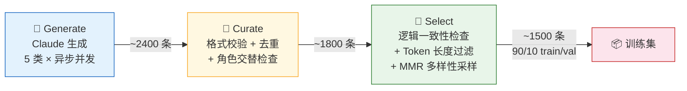
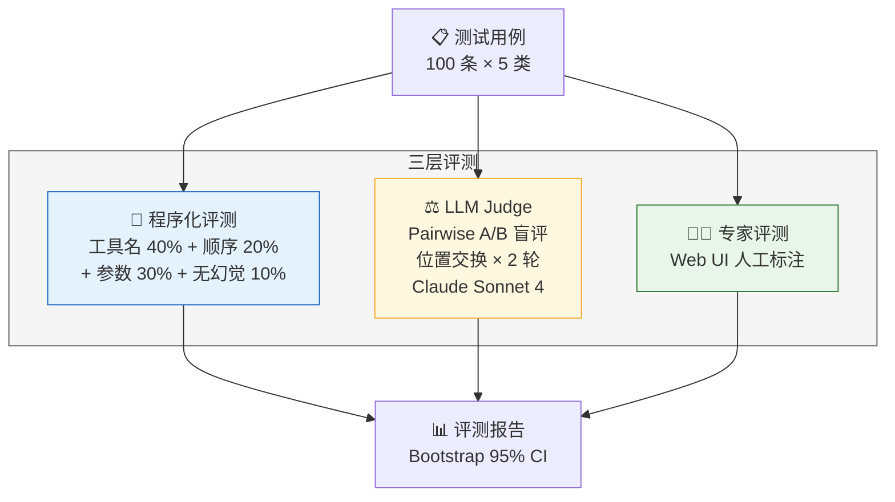

# CreditAgent：基于大模型微调的信贷审批智能 Agent

基于 Qwen2.5-14B-Instruct + LoRA 微调，通过 MCP 工具协议连接风控模型与知识库，实现端到端的智能信贷审批决策。

## 项目亮点

- **全链路 Agent 系统**：多轮 tool-call 编排循环（最多 6 轮），自主调用数据查询、风险预测、知识检索三个工具完成信贷审批
- **高质量 SFT 数据流水线**：3 阶段 generate → curate → select，含逻辑一致性校验 + BGE-m3 嵌入多样性采样（MMR），从 ~2400 条筛选至 ~1500 条
- **LightGBM 5 折集成风控模型**：610 维特征 + 自动风险因素归因，输出违约概率与 Top-5 影响因素的中文解释
- **多维评测体系**：程序化工具调用准确率 + LLM-as-a-Judge Pairwise 盲评（位置交换去偏差）+ 专家评测 UI
- **LoRA 高效微调**：assistant-only loss masking，仅训练 0.57% 参数，r=64/α=128 在 7 个投影层上

## 系统架构



## 核心模块

### Agent 编排

Agent 接收用户自然语言请求后，进入多轮 tool-call 循环：

1. 模型生成思考过程 + `<tool_call>` 标签
2. 解析工具名和参数，执行对应函数
3. 将 `<tool_response>` 注入对话上下文
4. 重复直到模型生成最终回答（无工具调用）或达到 6 轮上限

支持交互模式和单次查询两种使用方式。

### MCP 工具服务

通过 [Model Context Protocol](https://modelcontextprotocol.io/) 注册 3 个原子工具：

| 工具 | 功能 | 输入 | 输出 |
|------|------|------|------|
| `query_user_credit_data` | 查询客户信贷特征 | `user_id: int` | 13 个关键字段（收入、负债、逾期等） |
| `predict_risk_score` | 预测违约概率 | `features: dict` | 风险分、风险等级、Top-5 因素归因 |
| `search_knowledge_base` | 检索风控知识 | `query: str` | Top-3 相关文档片段 |

### 信用风控模型

- **模型架构**：LightGBM 5 折交叉验证集成，预测取均值
- **特征维度**：610 维，基于 Kaggle Home Credit 数据集的 Parquet 文件构建
- **特征工程**：类型转换、日期差分、多表聚合（Pipeline + Aggregator）
- **风险因素归因**：基于 gain importance × 特征值偏离度的综合评分，输出中文 Top-N 解释
- **风险等级**：低风险（< 0.3）/ 中风险（0.3–0.6）/ 高风险（> 0.6）

### RAG 知识检索

- **向量模型**：BAAI/bge-m3（多语言/多粒度）
- **索引**：FAISS IndexFlatIP（归一化向量 + 内积 = 余弦相似度）
- **切分策略**：按 Markdown 标题层级（## ~ ####）切分，超长段落（> 800 字符）按段落二次切分
- **知识库内容**：商业银行信用风险管理指引、个人贷款管理办法、巴塞尔协议风险权重、征信管理条例等

### SFT 数据流水线



**5 类数据分布：**

| 类型 | 场景 | 占比 | 工具调用模式 | 遴选目标 |
|------|------|------|-------------|---------|
| A | 完整审批请求 | 40% | query → predict → search（3-4 轮） | ~600 |
| B | 单步数据查询 | 15% | query（1 轮） | ~225 |
| C | 风控知识咨询 | 20% | search 或无工具 | ~300 |
| D | 风险解释 | 15% | query → predict（2-3 轮） | ~225 |
| E | 拒绝/边界 | 10% | 无工具调用 | ~150 |

### LoRA 微调

- **基座模型**：Qwen2.5-14B-Instruct
- **LoRA 配置**：r=64, α=128, dropout=0.05
- **目标层**：q/k/v/o_proj + gate/up/down_proj（7 层）
- **Loss 策略**：assistant-only masking（仅对 assistant 回复计算损失）
- **训练参数**：3 epochs, batch=1×8 grad accum, lr=2e-4, warmup 5%, bf16, gradient checkpointing

### 评测框架



- **程序化评测**：AST 解析 `<tool_call>` 标签，对比期望工具链，加权计算准确率
- **LLM-as-a-Judge**：base vs fine-tuned 模型 pairwise 对比，位置交换消除偏差，保守策略（两次一致才算有效判定）
- **专家评测**：HTTP 服务提供 Web UI，支持人工标注与结果导出
- **统计方法**：Bootstrap 1000 次采样，输出胜率 + 95% 置信区间

## 项目结构

```
credit_agent_project/
├── config.py                      # 集中配置（路径、模型参数）
├── src/
│   ├── main.py                    # CLI 入口（交互 / 单次查询）
│   ├── agent/                     # Agent 编排（orchestrator + tool_executor）
│   ├── mcp_server/                # MCP 工具服务（3 个工具）
│   ├── credit_risk_model/         # LightGBM 风控模型（特征工程 + 预测 + 归因）
│   ├── rag/                       # RAG 检索（索引构建 + 检索）
│   ├── sft_data_gen/              # SFT 数据流水线（generate / curate / select）
│   ├── training/                  # LoRA 训练脚本
│   └── evaluation/                # 评测框架（程序化 + LLM Judge + 专家 UI）
├── data/                          # 输入数据
│   ├── base_models/               # Qwen2.5-14B-Instruct 权重
│   ├── kaggle_raw/                # Kaggle Home Credit 原始数据
│   └── knowledge_base/            # RAG 知识库（Markdown）
├── outputs/                       # 产出
│   ├── models/                    # LightGBM + LoRA 适配器
│   ├── sft_data/                  # SFT 数据（raw → curated → selected）
│   ├── rag_index/                 # FAISS 索引
│   └── evaluation/                # 评测结果
├── tests/                         # 测试代码
└── docs/                          # 设计文档 + 开发日志
```

## 关键指标

| 指标 | 值 |
|------|-----|
| LoRA 可训练参数占比 | 0.57% |
| SFT 训练样本数 | ~1350（train）/ ~150（val） |
| 含工具调用数据占比 | 82.7% |
| 风控模型特征维度 | 610 |
| LightGBM 集成折数 | 5 fold |
| 评测用例数 | 100（5 类 × 20） |
| LLM Judge 位置交换轮次 | 2（消除位置偏差） |
| Agent 最大对话轮次 | 6 |
| RAG Top-K 检索 | 3 |

## 技术栈

| 类别 | 技术 |
|------|------|
| 基座模型 | Qwen2.5-14B-Instruct |
| 微调框架 | PyTorch + Transformers + PEFT (LoRA) |
| 推理加速 | vLLM |
| 工具协议 | MCP (Model Context Protocol) |
| 风控模型 | LightGBM |
| 向量检索 | FAISS + sentence-transformers (BGE-m3) |
| 特征工程 | Polars + Pandas |
| 数据生成 | Claude API (Anthropic) |
| 评测 Judge | Claude Sonnet 4 |
| 前端 | 原生 HTML/JS（专家评测 UI） |

## 快速开始

### 环境配置

项目使用两个独立的 conda 环境，避免训练和推理的依赖冲突：

```bash
# 环境 1：训练 + SFT 数据生成 + MCP 服务
conda create -n credit_agent python=3.11
conda activate credit_agent
pip install -r requirements.txt

# 环境 2：评测推理（vLLM）
conda create -n credit_agent_eval python=3.11
conda activate credit_agent_eval
pip install -r requirements_eval_min.txt
```

### 数据准备

1. 将 Qwen2.5-14B-Instruct 模型权重放入 `data/base_models/`
2. 将 Kaggle Home Credit 数据集放入 `data/kaggle_raw/`
3. 将风控知识库 Markdown 文件放入 `data/knowledge_base/`

### 运行 Agent

```bash
# 交互模式
python src/main.py

# 单次查询
python src/main.py --query "帮我审批客户ID=57543的贷款申请"
```

### 训练流水线

```bash
# 1. 构建 RAG 索引
python src/rag/build_rag_index.py

# 2. 生成 SFT 数据（需配置 ANTHROPIC_API_KEY）
python src/sft_data_gen/generate.py --type all

# 3. 清洗 + 筛选
python src/sft_data_gen/curate.py
python src/sft_data_gen/select.py

# 4. LoRA 微调
python src/training/train_lora.py

# 5. 评测
conda activate credit_agent_eval
python src/evaluation/llm_judge.py auto
```
